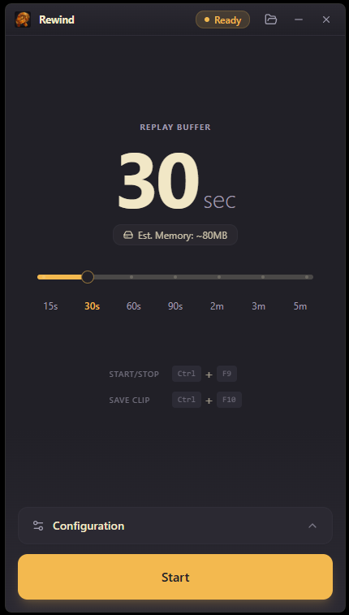
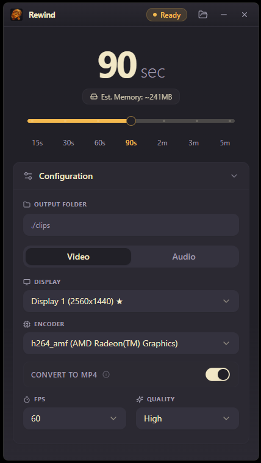
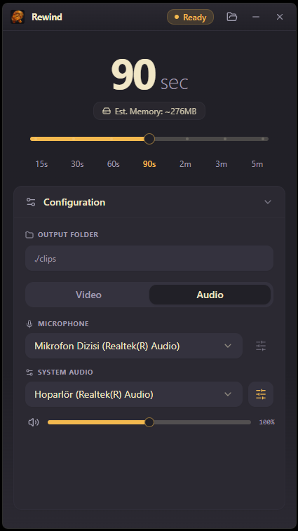
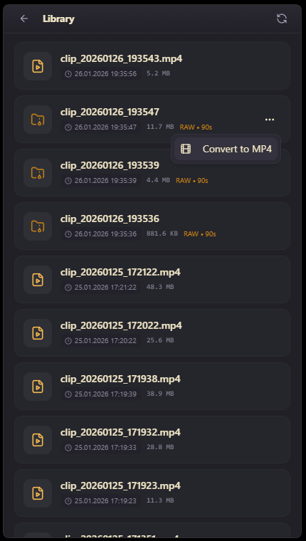
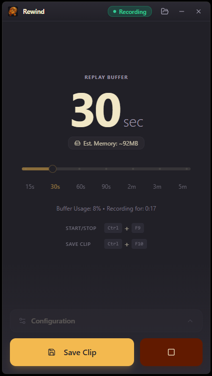

<h1 align="center">Rewind</h1>

<p align="center">
  A modern, lightweight screen recording application with instant replay capability.
</p>

<div align="center">

[](https://golang.org)
[](https://ffmpeg.org)
[](#)
[](https://wails.io)
[](https://github.com/your/repo/releases)


</div>


<p align="center">
  
</p>


## Overview

Rewind continuously captures your screen in the background and lets you save the last moments on demand. Built with performance in mind for a seamless recording experience.


## Features

- **Instant Replay** - Capture the last N seconds of screen activity with a single keystroke
- **Hardware Acceleration** - Automatic GPU detection and encoding (NVIDIA NVENC, AMD AMF, Intel QuickSync)
- **Audio Capture** - Record system audio and microphone simultaneously with independent volume controls
- **System Tray Integration** - Runs silently in the background with quick access via tray icon
- **Global Hotkeys** - Control recording without leaving your current application
- **Configurable Quality** - Adjustable FPS, bitrate, and buffer duration
- **Modern Interface** - Clean, frameless UI with smooth animations


## Tech Stack

- **Go** - High-performance backend logic and orchestration
- **Wails v3** - Modern desktop application framework
- **FFmpeg** - Industry-standard video processing and hardware encoding (NVENC, AMF, QuickSync)
- **WASAPI** - Low-latency Windows Audio Session API for loopback and microphone capture
- **React** - Dynamic and responsive frontend user interface
- **TypeScript** - Type-safe development for robust code

<p align="center">
  
</p>

## Installation

### Windows

1. [[[TODO]] **Download** the latest release from the [Releases](https://github.com/) page.     
2. **Choose** your installation method:
   - **Setup Installer** (`RewindSetup.exe`) - Installs to Program Files with shortcuts
   - **Portable Version** (`Rewind-Portable.zip`) - Extract and run from anywhere
3. **Run** the application and it will start minimized to the system tray

## Getting Started

1. **Launch** Rewind - it will appear in your system tray
2. **Start Recording** with <kbd>Ctrl</kbd> + <kbd>F9</kbd> to begin buffering
3. **Capture Moments** with <kbd>Ctrl</kbd> + <kbd>F10</kbd> to save the last N seconds
4. **Find Your Clips** in the clips folder (default: `%APPDATA%\Rewind\clips`)

### Configuration

- **Buffer Duration**: Set how many seconds to keep in memory (default: 30s)
- **Video Quality**: Adjust FPS (30/60/..) and bitrate.
- **Audio Sources**: Enable/disable system audio and microphone
- **Output Location**: Choose where clips are saved
- **Hardware Encoder**: Select your preferred GPU encoder or use cpu encoding


## Screenshots

<div style="display: flex; justify-content: center; gap: 10px; flex-wrap: wrap;">
  
  
  
  
  
</div>


## Building from Source

### Prerequisites

```bash
    # Install Go (1.21+)
    # Install Node.js (18+)
    # Install Wails CLI
    go install github.com/wailsapp/wails/v3/cmd/wails3@latest
    # Install NSIS for creating Windows installer
    # Download from https://nsis.sourceforge.io/
    # Download FFmpeg from the Releases page and place it in the bin/ folder.
```

### Build Steps

```bash
  # Build everything (executable + installer + portable ZIP)
  wails3 task package
```

### Development Mode (with Hot Reload)


```bash
  wails3 task dev
```

## Architecture

Rewind uses a circular buffer approach to maintain recent screen captures in memory:

- **Capture Thread**: Continuously captures screen frames using GPU-accelerated encoding
- **Audio Thread**: Records system and microphone audio via WASAPI
- **Buffer Manager**: Maintains a rolling window of video segments
- **Save Thread**: Assembles and exports clips when triggered

## License

This project is licensed under the Apache License 2.0 - see the [LICENSE](LICENSE) file for details.

---


<p align="center">
  <a href="mailto:emirakts0@gmail.com">emirakts0@gmail.com</a>
</p>
