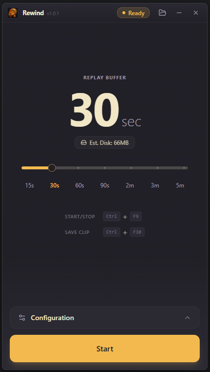
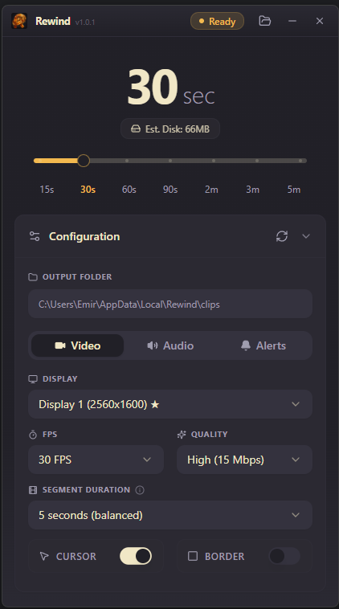
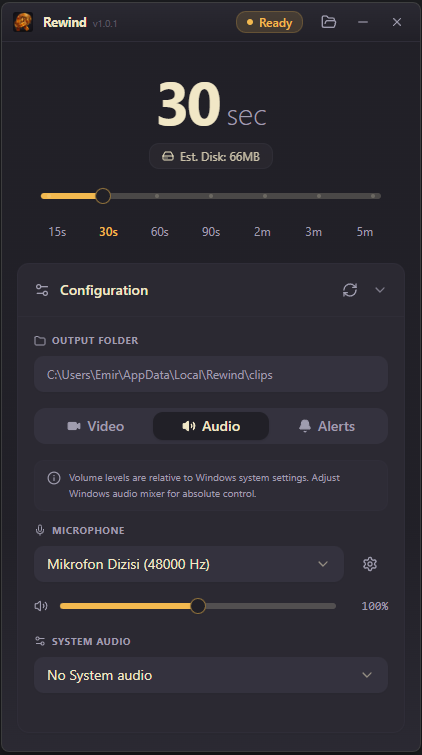
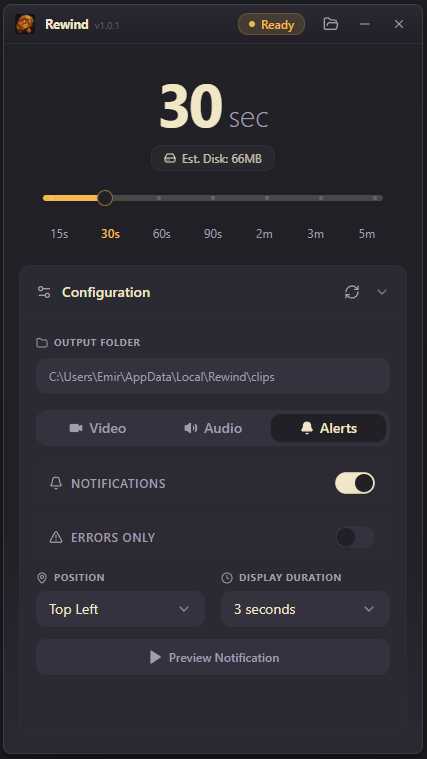
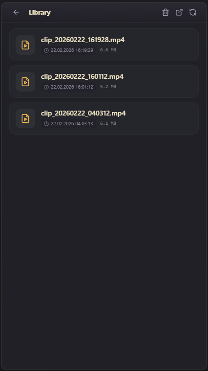
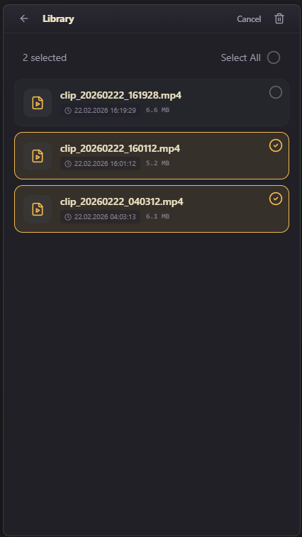

<p align="center">
  
</p>


<h1 align="center">Rewind</h1>

<p align="center">
  An elegant screen recording application with instant replay capability, written in Go and Rust, powered by FFmpeg.
</p>

<div align="center">

[](https://www.rust-lang.org)
[](https://golang.org)
[](https://ffmpeg.org)
[](#)
[](https://wails.io)
[](https://github.com/your/repo/releases)


</div>


## Overview

> Rewind continuously captures your screen in the background and lets you save the last moments on demand. Built with Rust for high-performance video capture and Go for application logic.
>
> *Co-authored with AI via vibe coding — where intuition meets infrastructure.*

## Features

- **Instant Replay** - Capture the last N seconds of screen activity with a single keystroke
- **Hardware Acceleration** - Native Windows Graphics Capture API with GPU encoding (H264)
- **Audio Capture** - Record system audio and microphone simultaneously with independent volume controls
- **Device Monitoring** - Automatically detects and handles monitor/audio device changes without polling
- **System Tray Integration** - Runs silently in the background with quick access via tray icon
- **Global Hotkeys** - Control recording without leaving your current application
- **Configurable Quality** - Adjustable FPS, bitrate, and buffer duration
- **Modern Interface** - Clean, frameless UI with smooth animations
- ... and more!


## Tech Stack

- **Rust** - High-performance native video/audio capture using Windows Graphics Capture API
- **Go** - Application logic and orchestration
- **Wails v3** - Modern desktop application framework
- **FFmpeg** - Video segment concatenation and audio muxing
- **CPAL** - Cross-platform audio library for microphone and loopback capture
- **React** - Dynamic and responsive frontend user interface
- **TypeScript** - Type-safe development for robust code


## Installation

### Windows

1. **Download** the latest release from the [Releases](https://github.com/emirakts0/rewind/releases) page.     
2. **Choose** your installation method:
   - **Setup Installer** (`RewindSetup.exe`) - Installs to Program Files with shortcuts
   - **Portable Version** (`Rewind-Portable.zip`) - Extract and run from anywhere
3. **Run** the application and it will start minimized to the system tray

## Getting Started

1. **Launch** Rewind - it will appear in your system tray
2. **Start Recording** with <kbd>Ctrl</kbd> + <kbd>F9</kbd> to begin buffering
3. **Capture Moments** with <kbd>Ctrl</kbd> + <kbd>F10</kbd> to save the last N seconds
4. **Find Your Clips** in the clips folder (default: `%APPDATA%\Rewind\clips`)

### Configuration

- **Buffer Duration**: Set how many seconds to keep in memory (default: 30s)
- **Video Quality**: Adjust FPS (30/60/..) and bitrate.
- **Audio Sources**: Enable/disable system audio and microphone
- **Output Location**: Choose where clips are saved
- **Hardware Encoder**: Select your preferred GPU encoder or use cpu encoding


## Screenshots

<div style="display: flex; justify-content: center; gap: 10px; flex-wrap: wrap;">
  
  
  
  
  
  
</div>


## Building from Source

### Prerequisites

```bash
    # Install Go (1.21+)
    # Install Node.js (18+)
    # Install Wails CLI
    # Install Rust (latest stable)
    go install github.com/wailsapp/wails/v3/cmd/wails3@latest
    # Install NSIS for creating Windows installer
    # Download from https://nsis.sourceforge.io/
    # Download FFmpeg from the Releases page and place it in the bin/ folder.
```

### Build Steps

```bash
  # Build everything (executable + installer + portable ZIP)
  wails3 task package
```

### Development Mode (with Hot Reload)


```bash
  wails3 task dev
```

## Architecture

Rewind uses a circular buffer approach with native Windows capture:

[![](https://mermaid.ink/img/pako:eNqFVm1v2zYQ_iuEgiwt5riS9WJFQAs4zpJuiNEgKVpg0z7Q5MkmLJECKSVx4_yufd8v2-ndTjPEMGyK99zDe-6OFJ8spjhYkXV8_CSkKCLyFMuTYg0ZnETkZEkNnIy6mW9UC7pMwZw0sFyLjOrtXKVKV-gjBxyYNA6t7Ss8FoOdcR4k3r79XGkOekCEZ0svoTUiFRJeNRhgSvLDhUMnnPhNpKALcWB0HXfiNasCX8E1XUJ6TtlmpVUp-cvAWVoa5DjfrF4yd5Y65Nro-d7Ub4JKlCzuxI86a46XP_aTlzQT6baa_gOKc02FNGShpBqRDH9NThmcxPIZv8_Hx7FMUvXA1lQX5OtFLE25XGmar8mc5kWpgfwVW93wmm5BE_LuFqN6H1t_x_KOaQD5LraaQecUy-9CcvVgyFXFJZjp6WY3v8fW-1jOSi4UOtb_g9_8ZnZN_v2HXCuVLzFj5ANZCKZVvlYSakeQPJaxJPi5gHvUhSQ4EAwqkaJQujFeC0wdKk-UJl00GRhDV2BqogbW6z0vkwTVodxbyFO6bSdqmaT9fBMc1G-S4ZL1kOAYm1kPiMUl-TyeBF6l4Q5WGciC3KqCFkLJetUOWOvGJfoU3Aq56tbsUTfzBTFOkELFdztbHFBcCLPBNarstystqER5e_63Kk0r3nGWe4StS7kxPcVeIvsk3NH7uuL1_43IodoSBym4qop2pcgsz1PBal1NXwyQL5qtwRT6f0RflFneq77EDl8PgHHOMsIRcOD2XekNaPS5vMxyWLXPg32uJEZCfiWz2bwtCT4syscDli9lkZcFsjQDMk9FvrcyZui11LSNfXr6aZdoig2067ugATQ6KjvGvuvr2hg7aOMvJE1xw3JimnrtuhK27dw8kNMxgjn2PFFpjzV74P3ub9HNBuDC4EElgRXAd1iqn4H3GAGnBRDEJWK1G3Zeg8XKfvxITFX-tSo2sP1QCpz5NJTuDdx-bbpc1OqNpLlBLPmFFHgS714yduqRVkMK9xT7udP-OnPlS34yNeMh4cgmcYvu2vp3QllKjbmABM-EjCQiTSM8kl3qJyNWHePR0ZnL_ISPsI_VBqIjdxlOkqB9PH0QvFhHk_zxBRkWYNOyTUPXt3u2hHHXG9gS_wzs5VtsuVasi83z3Qnv2MIAEsp6tsmE-T68xaaw5xsyd2lPA68j4yG-56Ano6HvJ9O3yFih05bNt-3ppGdLOPVo0rMB88Kzs7fY8L3U6aQOdaEjoz6GNugM3CBInFfI9uiGpsPC7s93_VWVaH--7Zcq1_vT7SGhqo4ZZrHtK-UHvM3uQgnWyFppwa2o0CWMrAx0RqtH66nCx1Z9o4mtCId4l9jEFr6B0Sen8k-lss4NrwirtRUlNDX4VObVbr0QFM_nrJ9tWnqOl4nCihzM_8gCXr36Fs3Vqr5h1cxW9GQ9WpFrB2MvDLElA2ca2Lbtj6wturrOGGvneG44nUynZ7b_PLJ-1MHY4yCwq9IGXugFoe2Ez_8BKqkgGg?type=png)](https://mermaid.ai/live/edit#pako:eNqFVm1v2zYQ_iuEgiwt5riS9WJFQAs4zpJuiNEgKVpg0z7Q5MkmLJECKSVx4_yufd8v2-ndTjPEMGyK99zDe-6OFJ8spjhYkXV8_CSkKCLyFMuTYg0ZnETkZEkNnIy6mW9UC7pMwZw0sFyLjOrtXKVKV-gjBxyYNA6t7Ss8FoOdcR4k3r79XGkOekCEZ0svoTUiFRJeNRhgSvLDhUMnnPhNpKALcWB0HXfiNasCX8E1XUJ6TtlmpVUp-cvAWVoa5DjfrF4yd5Y65Nro-d7Ub4JKlCzuxI86a46XP_aTlzQT6baa_gOKc02FNGShpBqRDH9NThmcxPIZv8_Hx7FMUvXA1lQX5OtFLE25XGmar8mc5kWpgfwVW93wmm5BE_LuFqN6H1t_x_KOaQD5LraaQecUy-9CcvVgyFXFJZjp6WY3v8fW-1jOSi4UOtb_g9_8ZnZN_v2HXCuVLzFj5ANZCKZVvlYSakeQPJaxJPi5gHvUhSQ4EAwqkaJQujFeC0wdKk-UJl00GRhDV2BqogbW6z0vkwTVodxbyFO6bSdqmaT9fBMc1G-S4ZL1kOAYm1kPiMUl-TyeBF6l4Q5WGciC3KqCFkLJetUOWOvGJfoU3Aq56tbsUTfzBTFOkELFdztbHFBcCLPBNarstystqER5e_63Kk0r3nGWe4StS7kxPcVeIvsk3NH7uuL1_43IodoSBym4qop2pcgsz1PBal1NXwyQL5qtwRT6f0RflFneq77EDl8PgHHOMsIRcOD2XekNaPS5vMxyWLXPg32uJEZCfiWz2bwtCT4syscDli9lkZcFsjQDMk9FvrcyZui11LSNfXr6aZdoig2067ugATQ6KjvGvuvr2hg7aOMvJE1xw3JimnrtuhK27dw8kNMxgjn2PFFpjzV74P3ub9HNBuDC4EElgRXAd1iqn4H3GAGnBRDEJWK1G3Zeg8XKfvxITFX-tSo2sP1QCpz5NJTuDdx-bbpc1OqNpLlBLPmFFHgS714yduqRVkMK9xT7udP-OnPlS34yNeMh4cgmcYvu2vp3QllKjbmABM-EjCQiTSM8kl3qJyNWHePR0ZnL_ISPsI_VBqIjdxlOkqB9PH0QvFhHk_zxBRkWYNOyTUPXt3u2hHHXG9gS_wzs5VtsuVasi83z3Qnv2MIAEsp6tsmE-T68xaaw5xsyd2lPA68j4yG-56Ano6HvJ9O3yFih05bNt-3ppGdLOPVo0rMB88Kzs7fY8L3U6aQOdaEjoz6GNugM3CBInFfI9uiGpsPC7s93_VWVaH--7Zcq1_vT7SGhqo4ZZrHtK-UHvM3uQgnWyFppwa2o0CWMrAx0RqtH66nCx1Z9o4mtCId4l9jEFr6B0Sen8k-lss4NrwirtRUlNDX4VObVbr0QFM_nrJ9tWnqOl4nCihzM_8gCXr36Fs3Vqr5h1cxW9GQ9WpFrB2MvDLElA2ca2Lbtj6wturrOGGvneG44nUynZ7b_PLJ-1MHY4yCwq9IGXugFoe2Ez_8BKqkgGg)

## License

This project is licensed under the Apache License 2.0 - see the [LICENSE](LICENSE) file for details.

---


<p align="center">
  
  <a href="mailto:emirakts0@gmail.com">emirakts0@gmail.com</a>
</p>
